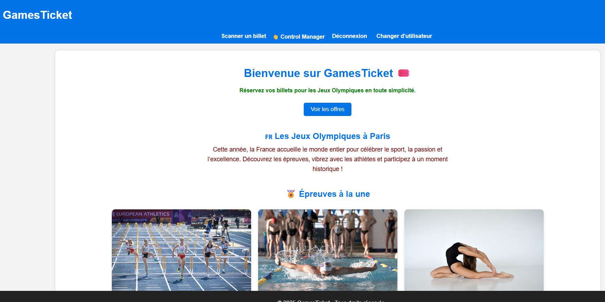
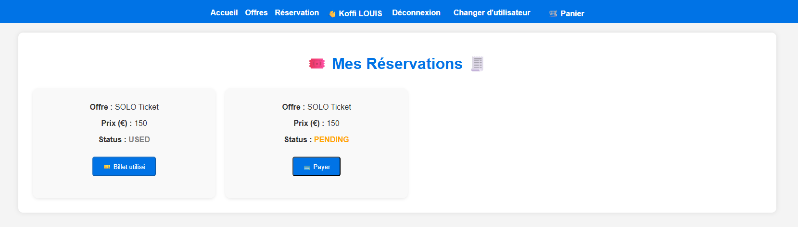
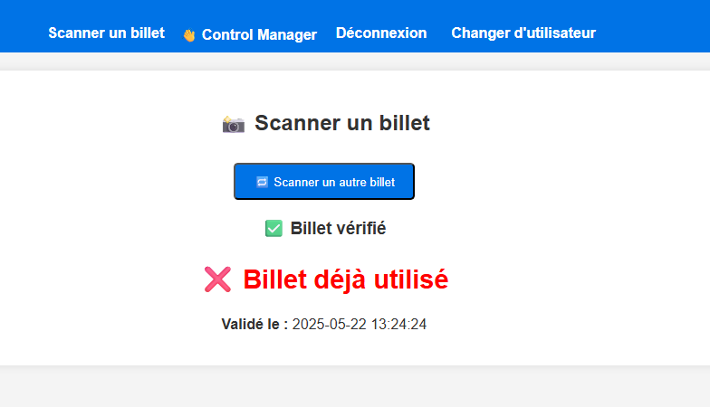
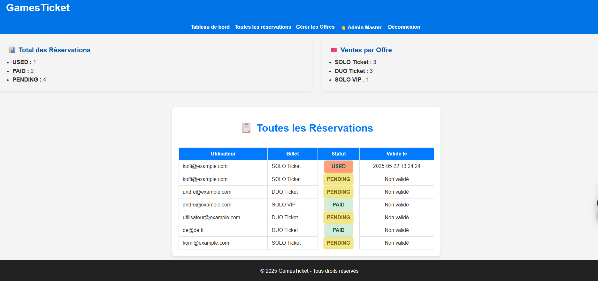

# 🎫 Games Ticket – Frontend React

Frontend de l’application de billetterie en ligne pour les Jeux Olympiques. Ce projet permet aux utilisateurs de consulter des offres de billets, réserver, payer et télécharger leur e-billet avec QR Code.

## Fonctionnalités principales

- Authentification sécurisée via JWT
- Parcours utilisateur : inscription, connexion, réservation, paiement
- Parcours administrateur : gestion des offres, réservations
- Scan et vérification des billets (QR code) pour les contrôleurs
- Interface responsive avec React.js


## Technologies utilisées

- React.js
- React Router DOM
- Axios
- Bootstrap
- JWT pour l’authentification (avec le backend Symfony)

---

## Installation locale

### Prérequis

- Node.js >= 16.x
- npm >= 8.x

### Cloner le projet

```bash
git clone https://github.com/ZAGOUE/games-ticket-frontend
cd games-ticket-frontend
```

### Installer les dépendances

```bash
npm install
```

### Configuration

Créer un fichier `.env` à la racine avec l’URL du backend :

```env
REACT_APP_API_URL=https://<games-ticket-backend>
```

> Remplacez l’URL par celle de votre backend (local ou déployé).

---

## Lancer l’application en local

```bash
npm start
```

L'application sera disponible sur `http://localhost:3000`

---


## Déploiement continu (Netlify)

L’application React est connectée à GitHub et déployée automatiquement avec **Netlify**.

### Configuration

1. Le dépôt GitHub est lié à Netlify via **Continuous Deployment**
2. La commande de build utilisée est :

```bash
npm run build
```

3. Le dossier publié est :

```
build
```

4. La variable d’environnement suivante est définie :

```env
REACT_APP_API_URL=https://<games-ticket-backend>
```

---

### Déploiement automatique

À chaque `git push`, Netlify :
- Récupère automatiquement le code depuis GitHub
- Exécute la commande de build
- Met à jour le site automatiquement

Cela permet de maintenir le site à jour **sans intervention manuelle**.

URL de production :  
[https://games-ticket.netlify.app](https://games-ticket.netlify.app)

---

## Captures d'écran

### Accueil


### Réservation


### Scan de QR Code


### Espace Admin


---

## Auteur

Projet réalisé dans le cadre de la formation **Bachelor Développement d'application Web** – Projet Games Ticket – 2025  
© STUDI – Komi AGOUZE
